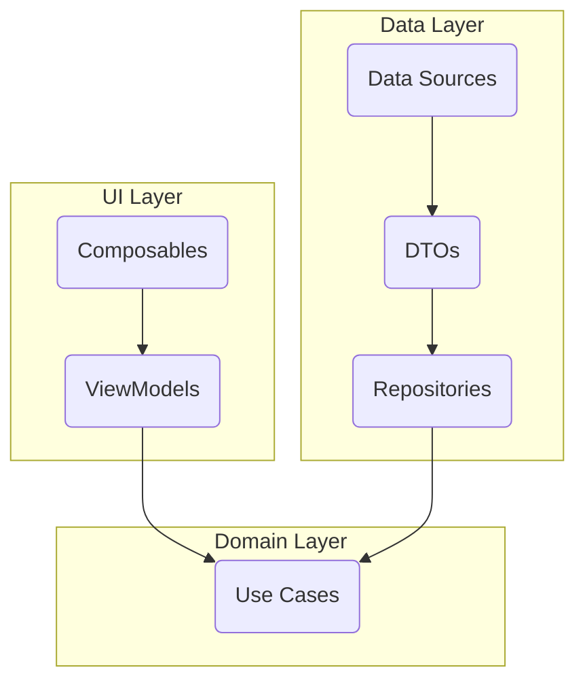

## App architectural principles to follow

### Layer-first Project structure
Feature folders are nested under these primary folders.
- UI Layer
  - Folder name: ui
  - This layer contains UI-related code such as composable, screens, and presentation logic. It interacts with the domain layer to retrieve data and update the UI accordingly. In KMM, you’ll find Screens, Business Logic Components, and ViewModels in this layer.
- Domain Layer (Optional)
  - Folder name: domain
  - The domain layer contains business logic and entities that represent the core functionality of your application. It defines the use cases and business rules without any dependencies on external frameworks or libraries. In KMM, this layer typically includes domain classes, business logic classes, and use cases.
- Data Layer 
  - Folder name: data
  - The data layer is responsible for handling data operations such as fetching data from remote or local sources, caching, and data transformation. It provides data to either the Domain Layer or the ViewModels in the Presentation Layer through repositories or data sources. In KMM, this layer includes repositories, data sources, and models for representing data

### Repository Pattern
- Use to access data objects from various sources, such as a backend API, and make them available as type-safe entities to the domain layer of the app
- Repositories are found in the data layer. And their job is to:
    - isolate domain models (or entities) from the implementation details of the data sources in the data layer.
    - convert data transfer objects to validated entities that are understood by the domain layer
    - (optionally) perform operations such as data caching.

### Diagram of the app Dependency flow through the Layers

### Follow these principles:
- Separation of concerns: UI-based classes should only contain logic that handles UI and operating system interactions.
- Single source of truth: When a new data type is defined in the app, assign a Single Source of Truth (SSOT) to it. The SSOT is the owner of that data, and only the SSOT can modify or mutate it. The SSOT exposes the data using an immutable type, and to modify the data, the SSOT exposes functions or receive events that other types can call.
- Unidirectional Data Flow: state flows in only one direction. The events that modify the data flow in the opposite direction.
- State is immutable and centralized
- State changes are explicit and predictable
- UI is a function of state
- Business logic is isolated from UI
- Dependency injection best practices.
- A reactive and layered architecture.

## Data Model mockup
- Recipe
    - name [String]
    - altName [String]
    - favorite [Boolean]
    - image [String of Path to image]
    - about [markdown or rich text]
    - tags [List of tag]
        - tag  [String]
    - instructions [List of instruction]
        - instruction  [Object]
            - value [markdown or rich text]
            - step [Number]
    - notes [markdown or rich text]
    - alcoholic [Boolean]
    - glassware [String]
    - garnish [String]
    - ingredients [List of ingredient]
        - ingredient [Object]
            - name [String]
            - amount [Object]
                - value [Number]
                - label [String]
            - notes [markdown or rich text]
